# TerriMap — Sơ đồ luồng code và kiến trúc

Tài liệu này mô tả **TerriMap chạy như thế nào trong code**, từ lúc app mở lên cho đến khi người dùng thao tác với bản đồ, nhân sự, báo cáo và thuật toán phân chia.

---

## 1) Mục tiêu của tài liệu

Sau khi đọc tài liệu này, bạn nên trả lời được:

- app bắt đầu từ file nào
- state đi qua đâu
- role được xác định thế nào
- tab nào render component nào
- thuật toán chạy ở đâu
- dữ liệu lưu ở đâu

---

## 2) Sơ đồ tổng quan cấp cao

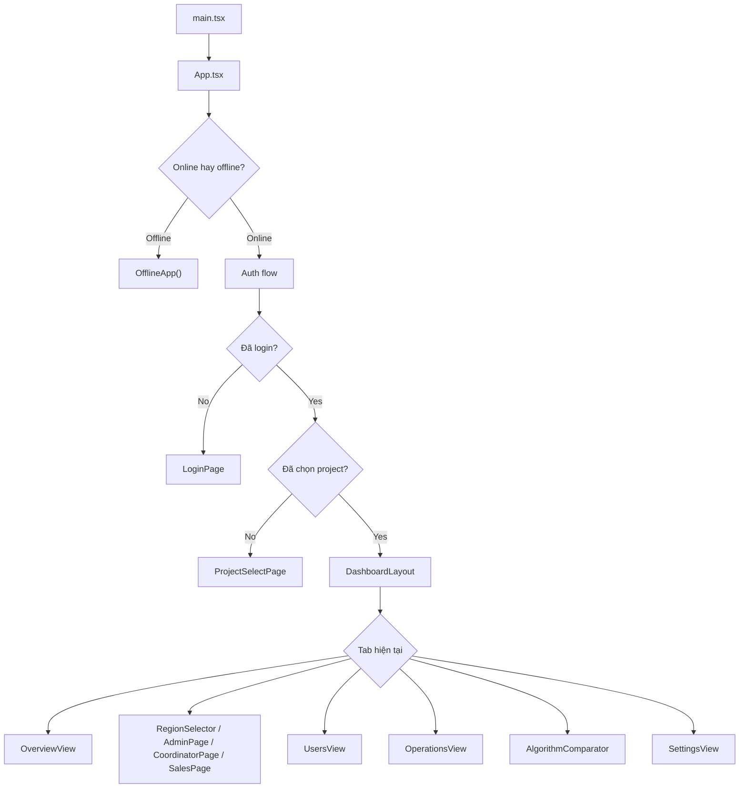

### Giải thích
- `main.tsx` là nơi áp theme, init telemetry và mount React root.
- `App.tsx` là bộ điều phối trung tâm.
- `DashboardLayout` quyết định tab đang active.
- Mỗi tab render ra một view hoặc page tương ứng.

---

## 3) Luồng khởi động app

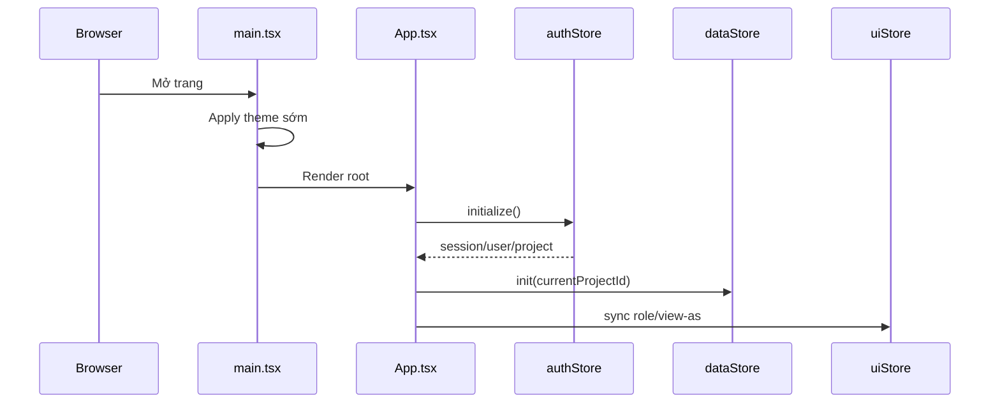

### Ý nghĩa
1. Theme được áp trước để tránh flash sáng/tối sai.
2. `initialize()` kiểm tra session.
3. Nếu có project thì dữ liệu project mới được load.
4. Role hiển thị được đồng bộ vào `uiStore`.

---

## 4) Flow đăng nhập và chọn dự án

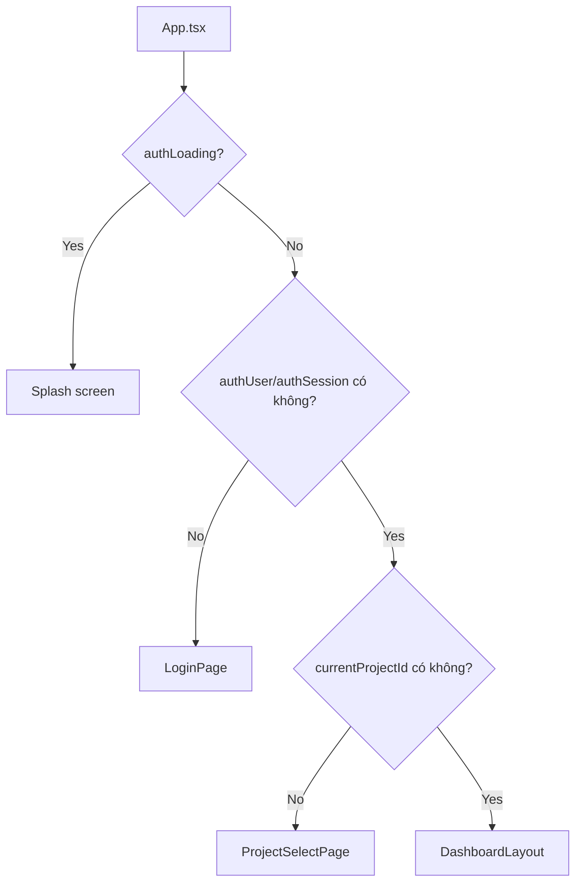

### Điểm cần nhớ
- Người dùng **không vào dashboard trực tiếp** nếu chưa có project.
- Project là ngữ cảnh làm việc quan trọng, nên luôn là bước trung gian.

---

## 5) Luồng dashboard

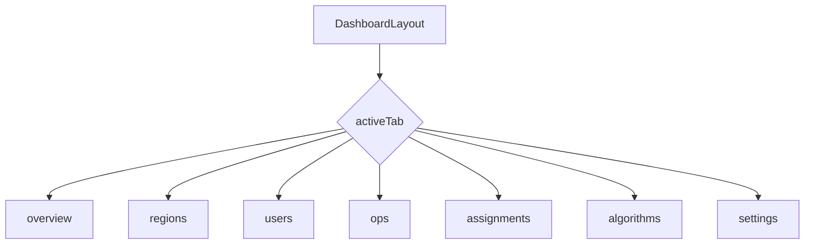

### Ghi nhớ nhanh
- `overview` → bức tranh tổng quan
- `regions` → quản lý vùng/bản đồ
- `users` → nhân sự
- `ops` → vận hành
- `assignments` → phân chia lãnh thổ
- `algorithms` → so sánh thuật toán
- `settings` → cài đặt

---

## 6) Luồng role và tab

### 6.1 Role đến từ đâu?

Trong `App.tsx`, role cuối cùng được tính từ:
- `membership` của project hiện tại
- `view-as` nếu user là admin
- owner project nếu chưa có membership rõ ràng

### 6.2 Vì sao có `effectiveRole`?

`effectiveRole` là role thực sự để render view.

Ví dụ:
- admin có thể xem như coordinator/sales nếu bật `view-as`
- sales không thể tự biến thành admin

### 6.3 Khi nào `currentRegionId` được set?

Nếu membership có `region_id` và role không phải admin:
- app tự chọn region đó
- giúp sales/coordinator vào đúng ngữ cảnh ngay

---

## 7) Luồng dữ liệu bản đồ

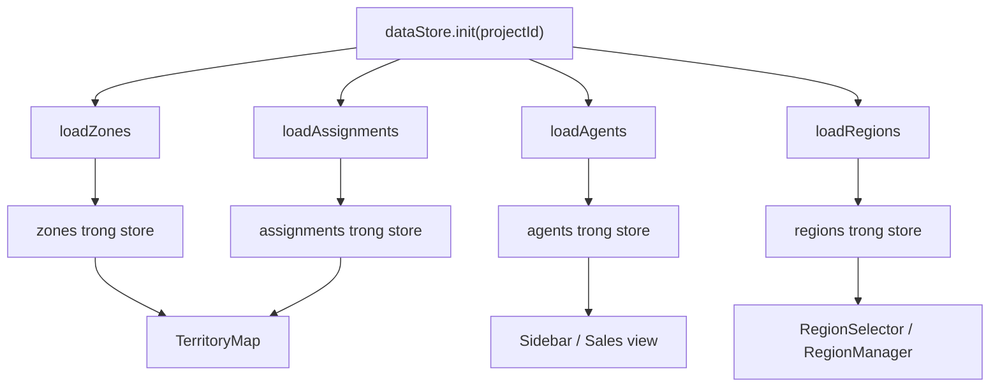

### Ý nghĩa
`dataStore` là nơi nạp dữ liệu đầu vào cho toàn bộ UI bản đồ.

---

## 8) Luồng quản lý vùng

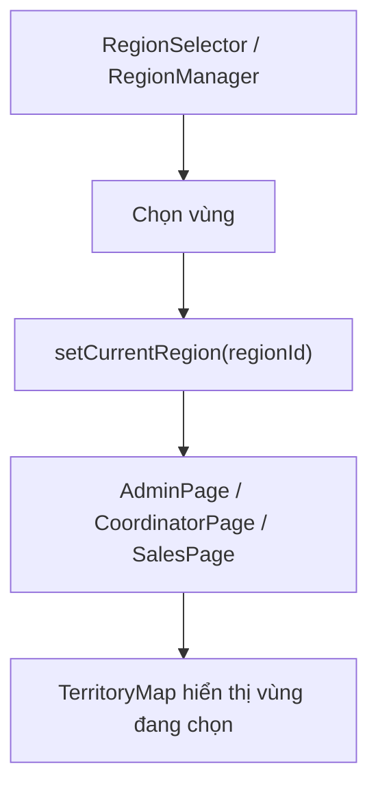

### Điểm quan trọng
- `currentRegionId` là cờ điều hướng cho các màn liên quan bản đồ.
- Nếu `null`, app thường yêu cầu chọn vùng trước.

---

## 9) Luồng quản lý thành viên

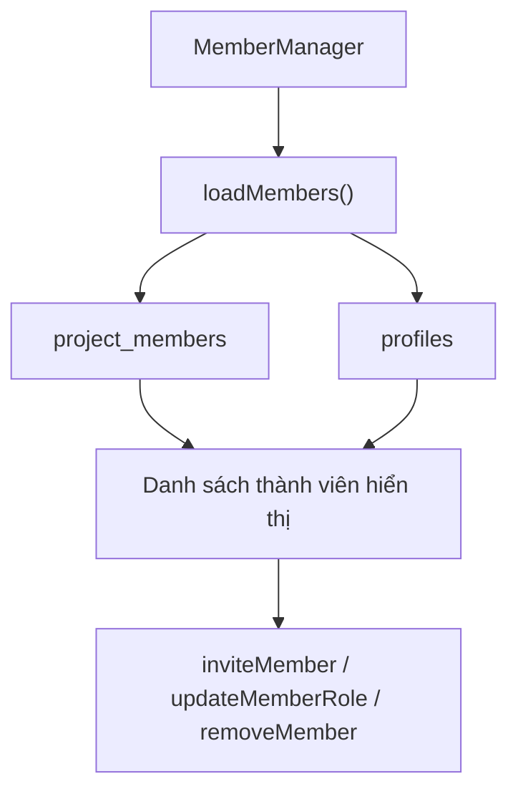

### Ý nghĩa
Màn nhân sự không chỉ đọc một bảng duy nhất mà ghép dữ liệu từ:
- membership trong project
- hồ sơ cá nhân trong profiles

---

## 10) Luồng báo cáo doanh số / cụm

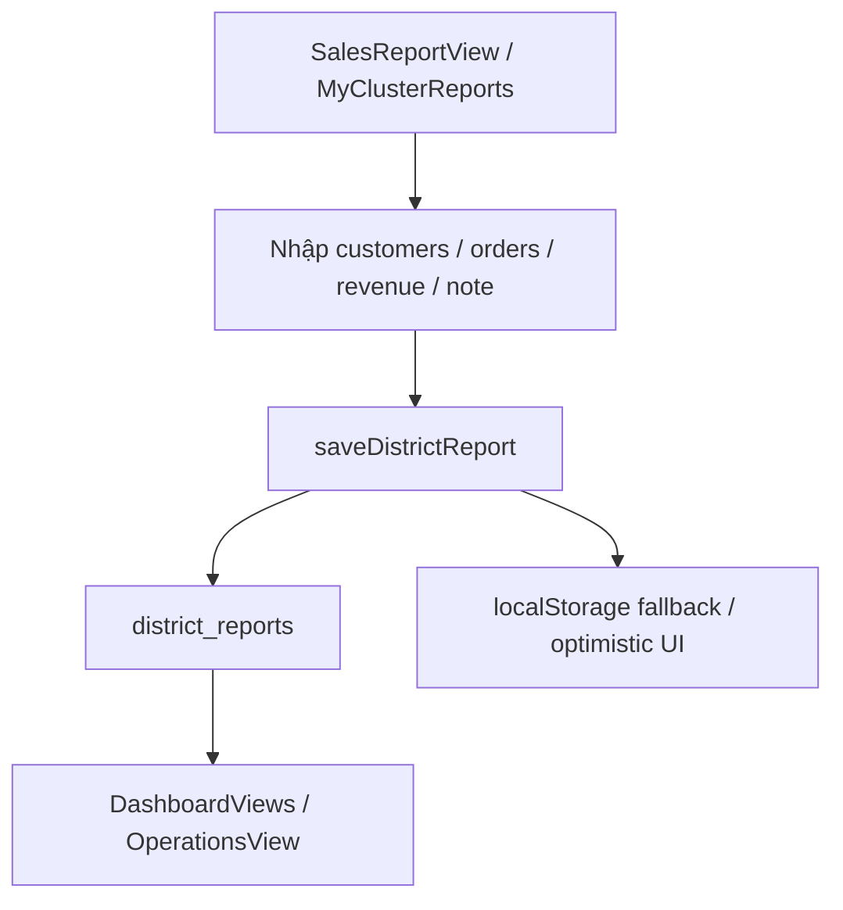

### Giải thích
- Sales nhập dữ liệu.
- Dữ liệu lưu theo project/region/district/user/period.
- Admin và điều phối đọc lại để tổng hợp trong tổng quan và vận hành.

---

## 11) Luồng thuật toán phân chia

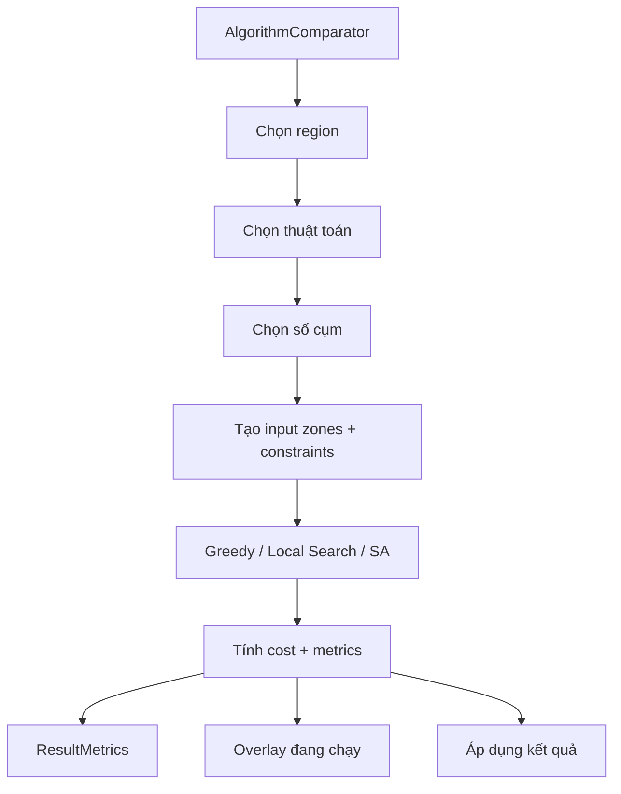

### Điểm đáng nhớ
- Greedy: tạo lời giải ban đầu.
- Local Search: tinh chỉnh.
- SA: tối ưu sâu hơn, chấp nhận chạy lâu hơn để có chất lượng cao hơn.

---

## 12) Luồng SA worker

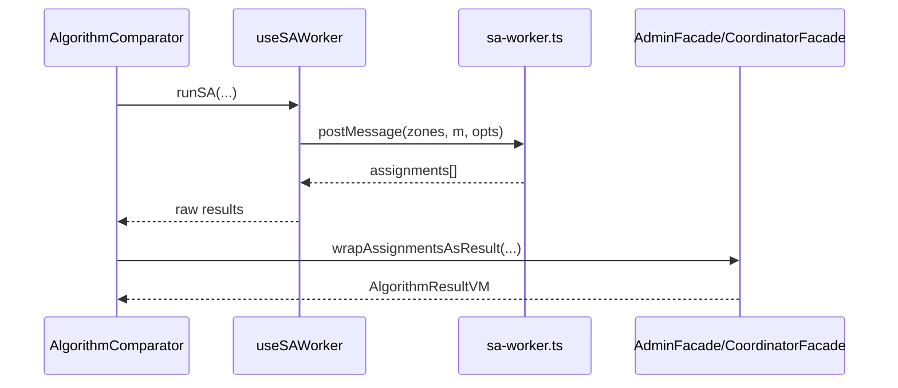

### Ý nghĩa
- Worker chỉ đổi nơi chạy, không đổi logic lõi.
- UI nhận `AlgorithmResultVM` đã chuẩn hóa để hiển thị.

---

## 13) Luồng lưu map / snapshot

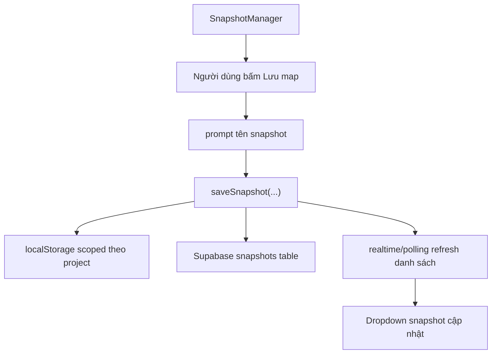

### Điểm cần nhớ
- Snapshot lưu theo project.
- UI dùng optimistic state để không chờ lâu.
- Sau khi lưu, dropdown snapshot phải cập nhật ngay.

---

## 14) Luồng UI/UX tối ưu trải nghiệm

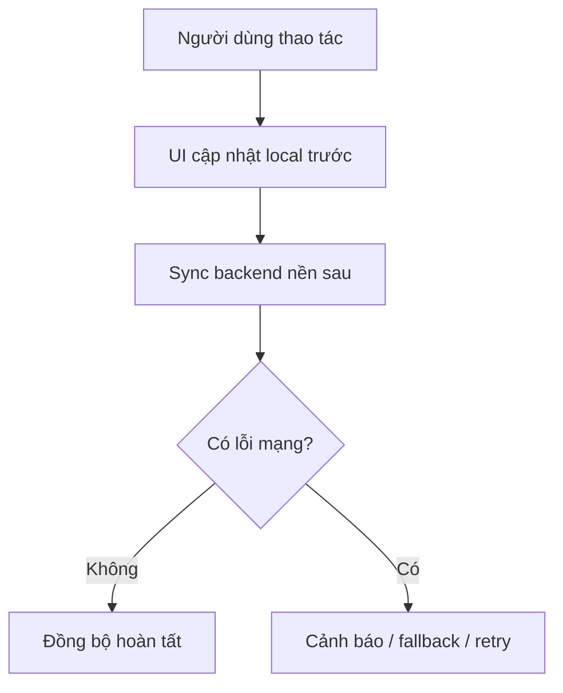

### Tại sao làm vậy?
- Người dùng thấy phản hồi ngay.
- Tránh cảm giác “bấm mà không thấy gì”.
- Các tác vụ dài không khóa toàn màn hình.

---

## 15) Dòng chảy giữa các file quan trọng

### 15.1 `main.tsx`
- set theme
- init telemetry
- mount `App`

### 15.2 `App.tsx`
- auth/project/role/tab orchestration

### 15.3 `authStore.ts`
- user, session, project, membership

### 15.4 `dataStore.ts`
- zones, assignments, agents, regions

### 15.5 `facades/*`
- quyền theo vai trò

### 15.6 `services/db.ts`
- load/save/search/snapshot

### 15.7 `components/map/*`
- bản đồ, vùng, draw, matrix

### 15.8 `components/algorithm/*`
- so sánh thuật toán, metrics, SA worker

### 15.9 `components/layout/*`
- shell, nav, topbar

---

## 16) Các nhánh dữ liệu quan trọng

### A. Auth branch
- login
- session
- project selection
- membership

### B. Data branch
- zones
- assignments
- agents
- regions

### C. Algorithm branch
- input zones
- constraints
- result assignments
- metrics

### D. Reporting branch
- district reports
- monthly metrics
- snapshots

---

## 17) Câu hỏi hội đồng thường gắn với sơ đồ này

### “Tại sao phải có nhiều store?”
Vì state khác domain, vòng đời khác nhau.

### “Tại sao không gọi API trực tiếp từ component?”
Vì cần layer rõ ràng để quản trị quyền và tái sử dụng logic.

### “Tại sao SA cần worker?”
Vì nặng và dễ làm đơ UI.

### “Tại sao có project scope?”
Vì dữ liệu phải cách ly theo dự án.

### “Tại sao snapshot lại đọc realtime/polling?”
Vì nhiều admin/coordinator cùng làm việc cần đồng bộ ngay.

---

## 18) Sơ đồ tóm tắt một dòng

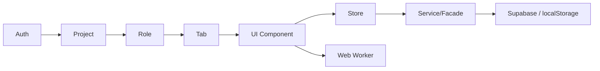

---

## 19) Câu chốt để ghi nhớ

> “TerriMap là một app điều phối theo luồng: auth → project → role → tab → store → service/facade → database/worker. Code được tách lớp để vừa dễ bảo trì, vừa đảm bảo UI không bị đơ khi xử lý dữ liệu và thuật toán nặng.”

