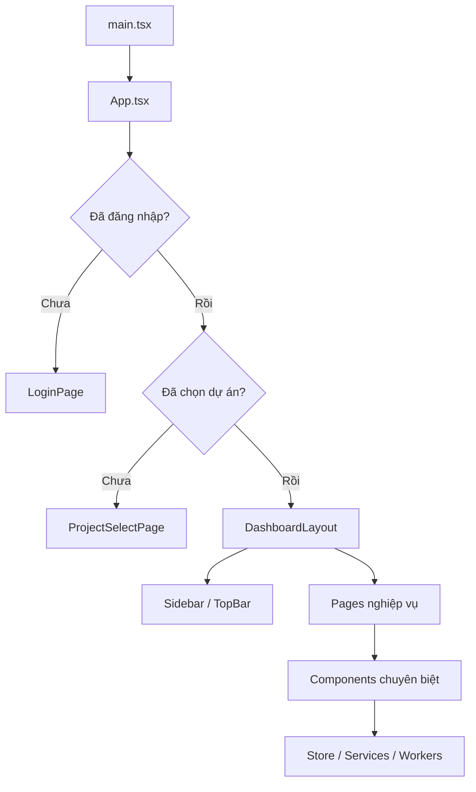

# Kiến Trúc Frontend TerriMap (`src`)

Tài liệu này mô tả chi tiết phần **frontend** của TerriMap nằm trong thư mục `src/`: cấu trúc thư mục, vai trò của từng lớp, luồng khởi động ứng dụng, cách dữ liệu đi qua UI, và nơi cần chỉnh khi muốn thay đổi giao diện hoặc hành vi.

Tài liệu được viết để phục vụ:
- người mới cần hiểu nhanh mã nguồn frontend;
- người chỉnh sửa UI/UX;
- người duy trì hệ thống;
- người chuẩn bị demo, nghiệm thu, hoặc bàn giao.

---

## 1) `src/` là gì?

`src/` là phần **ứng dụng web chính** của TerriMap. Đây là nơi chứa toàn bộ các thành phần để:

- hiển thị giao diện người dùng;
- điều hướng giữa các màn hình;
- gọi dữ liệu từ Supabase;
- lưu trạng thái giao diện;
- hiển thị bản đồ, vùng, khu vực, nhân sự, báo cáo, và thuật toán phân chia;
- xử lý trạng thái chờ, lỗi, và đồng bộ dữ liệu.

Nếu ví dự án như một ngôi nhà:

- `src/pages` là các **phòng chính**;
- `src/components` là các **món nội thất tái sử dụng**;
- `src/store` là **bộ nhớ làm việc** của ứng dụng;
- `src/services` là **cầu nối dữ liệu**;
- `src/styles` là **ngôn ngữ hình ảnh**;
- `src/workers` là **người làm việc nền** cho tác vụ nặng;
- `src/lib` là **tiện ích hạ tầng**;
- `src/data` là **dữ liệu tham chiếu**;
- `src/utils` là **công cụ phụ trợ**.

---

## 2) Bản đồ tổng quan thư mục

```text
src/
├── App.tsx
├── main.tsx
├── pages/
├── components/
├── store/
├── services/
├── lib/
├── context/
├── hooks/
├── data/
├── styles/
├── i18n/
├── utils/
├── workers/
├── types/
├── test-setup.tsx
└── test-utils.tsx
```

### Ý nghĩa ngắn gọn

- `App.tsx`: khung điều hướng chính và bộ xử lý lỗi cấp ứng dụng.
- `main.tsx`: điểm khởi động, nơi React được mount vào DOM.
- `pages/`: các màn hình lớn.
- `components/`: các khối UI nhỏ hơn, có thể ghép lại.
- `store/`: Zustand stores quản lý trạng thái toàn cục.
- `services/`: đọc/ghi dữ liệu Supabase và lưu cục bộ.
- `lib/`: hàm/hạ tầng dùng chung, đặc biệt là cấu hình Supabase.
- `context/`: context chia sẻ giữa những thành phần lớn.
- `hooks/`: custom hooks.
- `data/`: dữ liệu tĩnh, danh mục, bảng màu.
- `styles/`: tokens, theme, typography, spacing, màu sắc.
- `i18n/`: lớp ngôn ngữ.
- `utils/`: tiện ích xuất file, telemetry, helper.
- `workers/`: tác vụ nặng chạy nền.
- `types/`: khai báo type bổ sung.
- `test-setup.tsx`, `test-utils.tsx`: cấu hình test.

---

## 3) Luồng khởi động ứng dụng

Luồng khởi động của TerriMap đi theo thứ tự sau:

1. **`src/main.tsx`**
   - import CSS toàn cục;
   - khởi tạo i18n;
   - mount React root;
   - gắn các provider cần thiết.

2. **`src/App.tsx`**
   - kiểm tra trạng thái đăng nhập;
   - chọn màn hình phù hợp;
   - xử lý lỗi runtime và lỗi chunk tải động;
   - hiển thị đúng trang: đăng nhập, chọn dự án, hoặc dashboard.

3. **`src/pages/...`**
   - nếu chưa đăng nhập: `LoginPage`;
   - nếu đã đăng nhập nhưng chưa chọn dự án: `ProjectSelectPage`;
   - nếu đã có dự án: vào shell chính và hiển thị các trang nghiệp vụ.

4. **`src/components/layout/DashboardLayout.tsx`**
   - tạo khung giao diện chính;
   - hiển thị sidebar, top bar, nội dung trung tâm;
   - điều khiển tab/màn đang mở.

5. **Các component chuyên biệt**
   - render bản đồ, bảng, form, modal, báo cáo, thuật toán.

### Sơ đồ dòng chảy



---

## 4) Tầng giao diện: `pages/`

`src/pages` chứa các **màn hình lớn**. Mỗi page thường là một “container” điều phối component con, không nên nhét quá nhiều logic thấp cấp vào đây.

### 4.1 `LoginPage.tsx`

Màn đăng nhập:
- nhận email/mật khẩu;
- gọi `authStore.signIn`;
- hiển thị lỗi đăng nhập;
- chuyển sang màn chọn dự án hoặc dashboard tùy trạng thái.

#### Khi nào sửa file này?
- đổi bố cục màn đăng nhập;
- đổi nội dung tiêu đề/chào mừng;
- thêm/bớt trường đăng nhập;
- thay cách hiển thị lỗi đăng nhập.

---

### 4.2 `ProjectSelectPage.tsx`

Màn chọn dự án:
- hiển thị danh sách dự án;
- cho phép mở dự án hiện có;
- cho phép tạo dự án mới;
- cho phép đổi theme ngay từ màn chọn dự án;
- quản lý trạng thái tạo nhanh để người dùng thấy phản hồi sớm.

#### Khi nào sửa file này?
- muốn đổi layout card dự án;
- muốn thêm CTA “Tạo dự án mới”;
- muốn rút ngắn cảm giác chờ khi tạo dự án;
- muốn chỉnh trải nghiệm đổi dự án.

---

### 4.3 `DashboardViews.tsx`

Đây là file rất quan trọng: nó tập hợp nhiều **màn con nghiệp vụ** của dashboard.

Thường gồm:
- `Tổng quan`
- `Khu vực & bản đồ`
- `Nhân sự`
- `Vận hành`
- `Phân chia thuật toán`
- `Cài đặt`

File này thường là nơi:
- dựng các bảng KPI;
- lọc dữ liệu theo khu vực/tháng;
- hiển thị báo cáo;
- điều phối các hành vi giữa nhiều component con.

#### Khi nào sửa file này?
- thay nội dung màn tổng quan;
- đổi bảng báo cáo;
- thêm KPI;
- đổi hành vi bộ lọc khu vực/tháng;
- cập nhật các màn “quản trị nhẹ” trong dashboard.

---

### 4.4 `AdminPage.tsx`

Màn quản trị viên:
- chạy phân chia;
- quản lý vùng/khu vực;
- xem và áp dụng kết quả thuật toán;
- tương tác mạnh với bản đồ và dữ liệu dự án.

#### Khi nào sửa file này?
- chỉnh flow chạy thuật toán;
- đổi cách lưu phiên bản vùng;
- đổi hành vi quản trị khu vực;
- tối ưu trải nghiệm khi xử lý dữ liệu nặng.

---

### 4.5 `CoordinatorPage.tsx`

Màn điều phối viên:
- tương tự admin nhưng thường ở quyền thấp hơn;
- theo dõi và điều phối vùng;
- thao tác với thuật toán, bản đồ, và phân công theo quyền cho phép.

---

### 4.6 `SalesPage.tsx`

Màn nhân sự:
- xem khu vực được giao;
- nhập báo cáo cụm;
- xem bản snapshot/map liên quan;
- theo dõi kết quả công việc của bản thân.

---

## 5) Tầng shell giao diện: `components/layout/`

Đây là nhóm quyết định “xương sống” của UI.

### 5.1 `DashboardLayout.tsx`

Đây là shell chính của ứng dụng sau khi người dùng đã vào dự án.

Nó thường phụ trách:
- sidebar trái;
- top bar trên;
- khung nội dung trung tâm;
- trạng thái chọn tab;
- nút đổi dự án;
- theme toggle;
- hiển thị email/user hiện tại.

#### Vai trò thực tế
`DashboardLayout` quyết định cảm giác “đây là TerriMap”.
Nếu đổi bố cục hoặc theme chung, gần như chắc chắn phải chạm file này.

---

### 5.2 `Sidebar.tsx`

Thanh điều hướng trái:
- danh sách menu;
- icon cho từng mục;
- trạng thái active;
- lọc mục điều hướng;
- thu gọn/mở rộng trong một số chế độ.

#### Lưu ý thiết kế
- icon và text active phải rõ ràng;
- trạng thái selected không nên bị “trắng lóa” hoặc mất tương phản;
- đây là nơi rất hay sửa khi cải thiện UX.

---

### 5.3 `TopBar.tsx`

Thanh trên cùng:
- breadcrumb;
- nút thao tác nhanh;
- thông tin tài khoản;
- các toggle toàn cục như theme hoặc project switch.

---

### 5.4 `RegionSelector.tsx`

Component chọn khu vực làm việc:
- chọn khu vực hiện tại;
- tạo khu vực mới;
- xem số zone/sales/topology/components;
- đồng bộ ngữ cảnh khu vực giữa các màn liên quan.

Đây là component quan trọng vì nó nối:
- `Tổng quan`
- `Khu vực & bản đồ`
- `Phân chia lãnh thổ`
- `Vận hành`

---

### 5.5 `RightPanel.tsx`

Panel phụ bên phải:
- thường chứa thông tin chi tiết, công cụ phụ hoặc thao tác liên quan đến màn hiện tại.

---

## 6) Tầng bản đồ: `components/map/`

Đây là lớp hiển thị vùng, cụm, đường biên, và các thao tác bản đồ.

### 6.1 `TerritoryMap.tsx`

Component bản đồ chính:
- render Leaflet map;
- hiển thị polygon/vùng;
- xử lý chọn vùng;
- highlight trạng thái vùng;
- tương tác với zoom, center, overlay.

Đây là component trung tâm của màn `Khu vực & bản đồ`.

#### Khi nào sửa file này?
- muốn đổi style polygon;
- muốn đổi cách chọn vùng;
- muốn thêm tooltip;
- muốn thêm layer hiển thị mới;
- muốn tối ưu bản đồ khi nhiều vùng.

---

### 6.2 `DrawingToolbar.tsx`

Thanh công cụ để vẽ/chỉnh vùng:
- bật tắt chế độ vẽ;
- thêm/sửa/xóa hình;
- xử lý import CSS cho leaflet draw;
- hỗ trợ thao tác bản đồ.

---

### 6.3 `ZoneInfoPanel.tsx`

Panel thông tin của một vùng:
- tên vùng;
- dữ liệu liên quan;
- nút gán/cập nhật;
- các vùng khả dụng để chuyển/điều phối.

---

### 6.4 `MapLegend.tsx`

Chú giải bản đồ:
- giải thích màu của vùng;
- giải thích trạng thái;
- giúp người dùng hiểu nhanh bản đồ.

---

### 6.5 `ClusterLayer.tsx`

Layer hiển thị cụm trên bản đồ:
- tô màu theo cụm;
- phân biệt cụm hiện tại và các cụm khác;
- hỗ trợ nhìn nhanh kết quả phân chia.

---

### 6.6 `MatrixViewer.tsx`

Thường dùng để xem ma trận hoặc cấu trúc liên quan đến phân chia/bản đồ.

---

## 7) Tầng thuật toán: `components/algorithm/`

Đây là phần người dùng dùng để chạy và so sánh thuật toán phân chia.

### 7.1 `AlgorithmComparator.tsx`

Màn chính so sánh thuật toán:
- chọn thuật toán;
- chọn số cụm;
- chọn cấu hình;
- bấm chạy;
- xem kết quả;
- so sánh các phương án.

Đây là nơi người dùng thường nhìn thấy:
- overlay đang chạy;
- cost/score;
- balance;
- violations;
- max diameter;
- các metric kết quả.

---

### 7.2 `AlgorithmSelector.tsx`

Danh sách chọn thuật toán:
- Greedy;
- Local Search;
- Simulated Annealing;
- hoặc các thuật toán khác nếu có.

---

### 7.3 `ConstraintConfig.tsx`

Chỗ cấu hình ràng buộc:
- cân bằng;
- liên thông;
- ngưỡng chất lượng;
- quy tắc ưu tiên.

---

### 7.4 `ResultMetrics.tsx`

Hiển thị chỉ số chất lượng:
- cân bằng;
- vi phạm;
- độ rộng cụm tối đa;
- các chỉ số phụ trợ khác.

---

### 7.5 `ProgressBar.tsx`

Hiển thị tiến trình chạy thuật toán.

---

## 8) Tầng quản trị nhân sự và báo cáo

### 8.1 `components/admin/`

#### `MemberManager.tsx`
- quản lý thành viên dự án;
- mời/xóa/sửa vai trò;
- xem thông tin thành viên.

#### `RegionManager.tsx`
- quản lý vùng/khu vực;
- tạo/xóa/chỉnh vùng;
- dùng nhiều trong luồng admin.

---

### 8.2 `components/agent/`

#### `AgentManager.tsx`
- quản lý nhân sự bán hàng / agent;
- gán vùng phụ trách;
- theo dõi agent trong dự án.

---

### 8.3 `components/coordinator/`

#### `MetricsInput.tsx`
- nhập các chỉ số vận hành / báo cáo;
- phục vụ vai trò điều phối.

---

### 8.4 `components/reports/`

#### `MyClusterReports.tsx`
- nhập báo cáo cụm của người dùng;
- lưu theo kỳ;
- hỗ trợ xem nhanh dữ liệu đã nhập.

---

### 8.5 `components/export/`

#### `ExportPanel.tsx`
- xuất dữ liệu;
- tạo file tải về;
- hỗ trợ báo cáo offline.

---

### 8.6 `components/snapshot/`

#### `SnapshotManager.tsx`
- lưu snapshot bản đồ;
- mở lại snapshot;
- so sánh các snapshot;
- đồng bộ dữ liệu snapshot theo dự án.

#### `SnapshotCompare.tsx`
- so sánh hai snapshot;
- xem khác biệt giữa hai trạng thái bản đồ.

---

### 8.7 `components/version/`

#### `VersionHistory.tsx`
- theo dõi lịch sử phiên bản;
- hỗ trợ truy vết thay đổi.

---

## 9) Tầng trạng thái: `store/`

TerriMap dùng store để quản lý trạng thái toàn cục. Đây là nơi quan trọng nhất nếu bạn muốn hiểu “dữ liệu đang ở đâu”.

### 9.1 `authStore.ts`

Quản lý:
- đăng nhập / đăng xuất;
- profile người dùng;
- project hiện tại;
- danh sách project;
- vai trò thành viên;
- mời thành viên;
- tạo project;
- đổi project;
- update profile.

#### Đây là store rất quan trọng
Nó nối trực tiếp:
- auth Supabase;
- project context;
- membership;
- các tình huống người dùng đổi dự án.

---

### 9.2 `dataStore.ts`

Quản lý dữ liệu bản đồ / zone / assignment:
- vùng;
- phân công;
- sales agents;
- dữ liệu liên quan đến khu vực.

Nó thường là nơi:
- load dữ liệu từ service;
- giữ bản sao local;
- cập nhật UI nhanh;
- sync xuống backend sau.

---

### 9.3 `uiStore.ts`

Quản lý trạng thái UI:
- theme;
- ngữ cảnh giao diện;
- region đang xem;
- các cờ giao diện dùng chung.

Đây là nơi thường sửa khi:
- đổi sáng/tối;
- giữ trạng thái khu vực;
- đồng bộ giao diện giữa các màn.

---

## 10) Tầng dữ liệu và dịch vụ: `services/` và `lib/`

### 10.1 `lib/supabase.ts`

Khởi tạo Supabase client và helper môi trường:
- URL;
- anon key;
- các hàm kết nối cơ bản.

---

### 10.2 `services/db.ts`

Đây là file “xương sống dữ liệu” cho bản đồ và vùng.

Nó thường xử lý:
- load zones;
- save zone;
- delete zone;
- load assignments;
- save assignments;
- load snapshots;
- save snapshots;
- load regions;
- save regions;
- load sales agents.

#### Ý nghĩa thực tế
`db.ts` là lớp nối giữa:
- UI cần dữ liệu nhanh;
- local storage / fallback cache;
- Supabase remote.

Rất nhiều thao tác trong app đi qua file này.

---

### 10.3 `services/districtReportsDb.ts`

Quản lý báo cáo cụm theo kỳ:
- đọc;
- ghi;
- đồng bộ;
- fallback khi backend không có phản hồi.

---

### 10.4 `services/metricsDb.ts`

Quản lý chỉ số tổng hợp theo tháng:
- KPI;
- số liệu báo cáo;
- dữ liệu hiển thị cho dashboard.

---

## 11) Tầng hỗ trợ: `context/`, `hooks/`, `utils/`

### 11.1 `context/FacadeContext.tsx`

Lớp facade để UI gọi vào các nghiệp vụ phức tạp mà không cần biết chi tiết bên dưới.

Nó giúp:
- tách UI khỏi logic;
- giảm coupling;
- đổi thuật toán hoặc dữ liệu mà ít ảnh hưởng component.

---

### 11.2 `hooks/useSAWorker.ts`

Hook dùng để chạy Simulated Annealing qua Web Worker.

Mục tiêu:
- tránh đơ giao diện;
- giữ UI phản hồi;
- cho thấy thuật toán đang chạy.

---

### 11.3 `utils/exportUtils.ts`

Hàm xuất file và định dạng dữ liệu:
- export báo cáo;
- export CSV/PDF/Word nếu có;
- xử lý format đầu ra.

---

### 11.4 `utils/telemetry.ts`

Các helper đo/ghi nhận hành vi, sự kiện, hoặc chỉ số vận hành nội bộ nếu hệ thống dùng.

---

## 12) Dữ liệu tĩnh: `data/`

Thư mục này chứa dữ liệu tham chiếu:

- `district-colors.ts` — bảng màu theo cụm/vùng;
- `mock-agents.ts` — dữ liệu giả cho agent;
- `mock-zones.ts` — vùng mẫu;
- `provinces.ts` — danh sách tỉnh/thành;
- `regions.ts` — dữ liệu khu vực.

### Vai trò
- phục vụ demo;
- giúp app chạy khi chưa có backend đầy đủ;
- hỗ trợ test và seed dữ liệu.

---

## 13) Kiểu dữ liệu: `types/`

Ví dụ:
- khai báo type cho Leaflet marker cluster;
- khai báo type cho leaflet draw;
- các kiểu mở rộng cần dùng cho frontend.

Mục tiêu:
- giảm lỗi TypeScript;
- hỗ trợ autocomplete;
- giữ code an toàn hơn.

---

## 14) Giao diện nền tảng: `components/ui/`

Đây là bộ UI primitives:

- `Button.tsx`
- `Input.tsx`
- `Modal.tsx`
- `Toast.tsx`

### Ý nghĩa
Đây là những khối nền tảng có thể tái sử dụng ở nhiều màn:
- nút chuẩn;
- input chuẩn;
- modal chuẩn;
- thông báo toast chuẩn.

Khi muốn đồng bộ cảm giác UI toàn app, thường phải chỉnh ở đây trước.

---

## 15) Ngôn ngữ và giao diện chữ: `i18n/`

Thư mục `i18n/` chứa:
- `vi.json`
- `en.json`
- `index.ts`

### Vai trò
- quản lý chuỗi hiển thị;
- hỗ trợ phân tách text khỏi code;
- dù hiện tại TerriMap đang dùng tiếng Việt cố định ở nhiều luồng, lớp i18n vẫn là nền tảng để mở rộng hoặc đồng bộ thông điệp.

---

## 16) Kiểu dáng, màu sắc, khoảng cách: `styles/`

### `styles/tokens.css`

Đây là nơi chứa:
- màu chủ đạo;
- màu nền;
- typography;
- spacing;
- radius;
- shadow;
- theme tokens.

### Tại sao quan trọng?
Vì đây là nơi giúp:
- đổi theme nhanh;
- giữ tính nhất quán giữa các màn;
- sửa các vấn đề font / contrast / dark mode;
- định nghĩa ngôn ngữ thị giác chung của toàn bộ app.

---

## 17) Worker: `workers/`

### `sa-worker.ts`

Web Worker dành cho Simulated Annealing.

### Mục đích
- chạy thuật toán nặng trên luồng nền;
- tránh khóa main thread;
- giữ trải nghiệm UI mượt hơn.

Nếu thuật toán bị nặng:
- UI vẫn có thể hiển thị overlay trạng thái;
- người dùng biết hệ thống đang xử lý;
- trình duyệt ít bị “không phản hồi”.

---

## 18) Test setup: `test-setup.tsx`, `test-utils.tsx`

Hai file này phục vụ test:

- cấu hình môi trường test;
- mock những dependency cần thiết;
- render component an toàn hơn trong test.

Nếu thêm test mới cho frontend, thường sẽ cần hiểu hai file này.

---

## 19) Luồng dữ liệu từ UI đến Supabase

Đây là điểm rất quan trọng để hiểu `src`.

### Luồng điển hình

1. Người dùng thao tác ở UI.
2. Component gọi action từ `store`.
3. Store gọi `services/` hoặc `lib/`.
4. Service đọc/ghi local cache và Supabase.
5. Store cập nhật lại state.
6. UI render lại theo state mới.

### Ví dụ
- người dùng bấm lưu vùng:
  - component gọi hàm lưu;
  - `db.ts` lưu local trước;
  - Supabase sync chạy nền;
  - UI cập nhật ngay;
  - đồng nghiệp trong cùng dự án có thể nhận cập nhật nếu có realtime/polling.

---

## 20) Nơi nên sửa khi muốn thay đổi một tính năng cụ thể

### Nếu muốn đổi giao diện một màn
- vào `src/pages/...`;
- sau đó rà `src/components/...` liên quan;
- nếu là màu/chữ/theme, xem thêm `src/styles/tokens.css`.

### Nếu muốn đổi dữ liệu hoặc hành vi lưu
- kiểm tra `src/store/...`;
- kiểm tra `src/services/...`;
- nếu liên quan thuật toán, kiểm tra `src/workers/...` hoặc `lib/partition.ts` ở ngoài `src`.

### Nếu muốn đổi text tiếng Việt
- sửa file màn hình hoặc component;
- nếu là chuỗi tái sử dụng, sửa `src/i18n/vi.json`.

### Nếu muốn làm UI mượt hơn
- xem `src/components/ui/`;
- xem `src/hooks/useSAWorker.ts`;
- xem `src/workers/sa-worker.ts`;
- xem logic async ở store/service.

---

## 21) Những file cần đọc trước tiên nếu mới vào dự án

Nếu muốn hiểu nhanh TerriMap, nên đọc theo thứ tự:

1. `src/main.tsx`
2. `src/App.tsx`
3. `src/store/authStore.ts`
4. `src/store/dataStore.ts`
5. `src/store/uiStore.ts`
6. `src/components/layout/DashboardLayout.tsx`
7. `src/pages/DashboardViews.tsx`
8. `src/components/map/TerritoryMap.tsx`
9. `src/components/algorithm/AlgorithmComparator.tsx`
10. `src/services/db.ts`

Đây là “đường tắt” tốt nhất để hiểu phần frontend của hệ thống.

---

## 22) Kết luận

`src/` chính là toàn bộ frontend của TerriMap: từ màn đăng nhập, chọn dự án, shell chính, bản đồ, nhân sự, báo cáo, đến phân chia thuật toán.

Nếu cần nhớ một câu ngắn:

> `pages` quyết định màn hình, `components` quyết định khối UI, `store` giữ trạng thái, `services` chạm dữ liệu, `workers` xử lý việc nặng, `styles` giữ diện mạo.

Nắm được 6 lớp đó là đã có thể sửa phần lớn frontend của TerriMap một cách an toàn.

