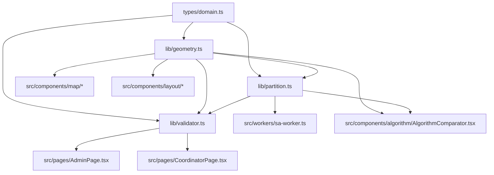

# Tài liệu chi tiết về thư mục `lib`

## 1. Mục tiêu của `lib`

Thư mục `lib` là **lõi tính toán nghiệp vụ** của TerriMap. Nếu `src/components`, `src/pages` là phần giao diện và tương tác người dùng, thì `lib` là nơi xử lý:

- hình học bản đồ;
- quan hệ liền kề giữa các vùng;
- thuật toán phân chia cụm;
- kiểm tra chất lượng và tính hợp lệ của phương án phân chia.

Điểm quan trọng nhất:

- `lib` **không phụ thuộc UI**;
- `lib` ưu tiên **pure function**: đầu vào rõ ràng, đầu ra rõ ràng, ít side effect;
- `lib` là nơi cần được tin cậy nhất vì các quyết định phân cụm, cân bằng tải và liên thông đều đi qua đây.

Hiện tại `lib` gồm 3 file chính:

- `lib/geometry.ts`
- `lib/partition.ts`
- `lib/validator.ts`

---

## 2. Vị trí của `lib` trong kiến trúc tổng thể

Ta có thể nhìn dự án theo tầng như sau:

### 2.1. Tầng dữ liệu và kiểu dữ liệu

- `types/`
- `services/`
- `src/store/`
- `src/context/`

Đây là nơi định nghĩa model, store, trạng thái ứng dụng, dữ liệu từ Supabase hoặc local-first cache.

### 2.2. Tầng tính toán lõi

- `lib/geometry.ts`
- `lib/partition.ts`
- `lib/validator.ts`

Đây là tầng “ra quyết định toán học”.

### 2.3. Tầng giao diện

- `src/pages/`
- `src/components/`

Đây là nơi hiển thị kết quả cho người dùng, gọi các hàm trong `lib`, sau đó render ra dashboard, bản đồ, báo cáo, so sánh thuật toán.

### 2.4. Luồng phụ trợ chạy nền

- `src/workers/sa-worker.ts`

Worker này dùng cho Simulated Annealing để tránh khóa giao diện khi chạy lâu.

### 2.5. Sơ đồ phụ thuộc

Ý nghĩa:

- `geometry.ts` là nền tảng thấp nhất trong `lib`;
- `partition.ts` dùng kết quả hình học để phân cụm;
- `validator.ts` đánh giá phương án đã phân cụm;
- UI gọi `lib`, nhưng `lib` không gọi ngược UI.

---

## 3. Tổng quan trách nhiệm của từng file

## 3.1. `geometry.ts`

Phụ trách:

- tính khoảng cách;
- tính centroid;
- kiểm tra điểm nằm trong polygon;
- phát hiện polygon chồng lấn;
- xây ma trận kề;
- xây ma trận khoảng cách;
- kiểm tra lỗi topo của vùng.

Đây là file nền tảng nhất cho bài toán bản đồ.

## 3.2. `partition.ts`

Phụ trách:

- định nghĩa kiểu assignment;
- định nghĩa tùy chọn thuật toán;
- triển khai các thuật toán phân chia:
  - Greedy
  - Local Search
  - Simulated Annealing
- tính `cost` của một phương án phân cụm;
- đảm bảo tính liên thông khi gán vùng vào cụm.

Đây là file quan trọng nhất về mặt thuật toán.

## 3.3. `validator.ts`

Phụ trách:

- chấm điểm cân bằng;
- kiểm tra vi phạm liên thông;
- kiểm tra cụm có đường kính quá lớn không;
- tổng hợp các chỉ số chất lượng của phương án.

Đây là file dùng để trả lời câu hỏi: **“phương án phân chia này tốt hay không?”**

---

## 4. Phân tích chi tiết `lib/geometry.ts`

## 4.1. Vai trò

`geometry.ts` là “bộ máy hình học” của dự án.

Nó xử lý các khái niệm cơ bản:

- tọa độ;
- khoảng cách địa lý;
- quan hệ tiếp giáp;
- kiểm tra topo polygon.

Toàn bộ logic phân chia cụm và kiểm định sau cùng đều dựa trên các phép tính ở đây.

## 4.2. Tư tưởng thiết kế

Ngay phần đầu file đã thể hiện rõ triết lý:

- chỉ import từ `types/domain.ts`;
- không import UI/framework;
- pure function;
- xử lý edge-case rõ ràng;
- tránh trả về `NaN`, `Infinity`.

Đây là một thiết kế tốt vì:

- dễ test;
- dễ tái sử dụng;
- ít phụ thuộc;
- thuận lợi khi chuyển logic sang worker hoặc backend nếu cần.

## 4.3. Các kiểu dữ liệu chính

- `LatLng = Coordinate`
- `AdjMatrix = AdjacencyMatrix`
- `DistMatrix = DistanceMatrix`

Mục đích:

- giữ tương thích với cách gọi quen thuộc trong bản đồ (`LatLng`);
- rút gọn tên cho code bên ngoài.

## 4.4. `GeometryError`

Lớp lỗi chuyên biệt cho phần hình học.

Ý nghĩa:

- nếu lỗi xảy ra ở đây, thường là lỗi contract hoặc dữ liệu hình học bất thường;
- giúp phân biệt lỗi hình học với lỗi store, lỗi network hoặc lỗi UI.

## 4.5. `haversineDistance(a, b)`

Đây là hàm tính khoảng cách giữa hai điểm trên bề mặt Trái Đất theo công thức Haversine.

### Vì sao dùng Haversine?

Vì dữ liệu bản đồ là lat/lng, không phải hệ tọa độ phẳng tuyệt đối. Nếu dùng khoảng cách Euclid trực tiếp trên lat/lng thì sẽ sai về mặt địa lý.

### Đầu vào

- `a: LatLng`
- `b: LatLng`

### Đầu ra

- số km giữa 2 điểm

### Đặc điểm kỹ thuật

- độ phức tạp `O(1)`;
- có clamp để tránh lỗi số thực;
- chuẩn hóa `-0` thành `0`.

### Ý nghĩa trong dự án

Hàm này được dùng để:

- đo khoảng cách giữa centroid các vùng;
- tính độ phân tán của cụm;
- tính đường kính cụm;
- hỗ trợ objective `p-median` và `p-center`.

## 4.6. `polygonCentroid(coords)`

Hàm tính tâm hình học của polygon bằng công thức shoelace.

### Xử lý edge-case rất quan trọng

- `0 điểm` → throw lỗi;
- `1 điểm` → trả về chính điểm đó;
- `2 điểm` → trả về trung điểm;
- polygon suy biến, diện tích gần `0` → fallback sang trung bình cộng.

### Vì sao điều này quan trọng?

Trong dữ liệu thực tế:

- polygon có thể bị lỗi;
- người dùng có thể vẽ chưa chuẩn;
- vùng mới tạo có thể chưa đủ đẹp về hình học.

Nếu không phòng các trường hợp này, thuật toán phân chia phía sau sẽ rất dễ phát sinh `NaN`.

## 4.7. `zoneDiameter(zones)`

Hàm tính “đường kính” của một tập vùng:

- là khoảng cách lớn nhất giữa centroid của hai vùng bất kỳ trong cùng tập.

### Ý nghĩa nghiệp vụ

Đường kính cụm càng lớn thì:

- cụm càng trải rộng;
- sales/coordinator càng khó quản lý;
- chi phí di chuyển thực tế có xu hướng cao hơn;
- mức độ “gọn” của cụm thấp hơn.

Đây là chỉ số quan trọng khi đánh giá chất lượng phân chia.

## 4.8. `getMinBoundaryDistKm(zoneA, zoneB)`

Hàm này đo khoảng cách biên gần nhất giữa hai polygon/vùng.

### Vai trò

Khi hai vùng không chồng lấn nhưng biên rất gần nhau, ta có thể dùng ngưỡng khoảng cách nhỏ để xem chúng “gần như tiếp giáp”.

Điều này giúp:

- xử lý dữ liệu vẽ hơi lệch;
- hỗ trợ xây đồ thị adjacency mềm hơn;
- tránh trường hợp hình học đúng về mắt người nhưng máy lại coi là rời.

## 4.9. `buildAdjacencyMatrix(zones, thresholdKm?)`

Đây là một trong những hàm quan trọng nhất của `geometry.ts`.

### Chức năng

Xây ma trận kề/đồ thị kề giữa các vùng:

- mỗi vùng là một đỉnh;
- hai vùng nối cạnh nếu đủ điều kiện liền kề.

### Vì sao rất quan trọng?

Vì toàn bộ bài toán “phân chia lãnh thổ liên thông” dựa trên đồ thị này.

Nếu adjacency sai thì:

- thuật toán có thể chia cụm bị đứt;
- validator có thể đánh giá sai;
- giao diện vận hành/map sẽ hiển thị phương án không hợp lý.

### Đầu ra

Một cấu trúc dạng:

- key là `zone.id`
- value là danh sách `zone.id` kề với nó

### Ứng dụng thực tế trong dự án

Hàm này được gọi ở:

- `src/pages/CoordinatorPage.tsx`
- `src/components/algorithm/AlgorithmComparator.tsx`
- `src/components/layout/RegionSelector.tsx`

Điều đó cho thấy nó vừa phục vụ UI giám sát, vừa phục vụ lõi thuật toán.

## 4.10. `buildDistanceMatrix(zones)`

Hàm xây ma trận khoảng cách giữa các vùng.

### Ý nghĩa

Nếu nhiều chỗ cần tra cứu khoảng cách lặp đi lặp lại, có thể tính trước để:

- tránh lặp phép đo;
- tối ưu thời gian cho các thuật toán.

Trong các bài toán territory design lớn hơn, ma trận này cực kỳ hữu ích.

## 4.11. `meanCoordinate(coords)`

Hàm tính trung bình tọa độ.

Nó đơn giản nhưng lại xuất hiện ở nhiều bước:

- tìm center tạm của cụm;
- hỗ trợ objective `p-median`;
- dùng như một tâm đại diện rẻ hơn so với centroid hợp nhất phức tạp.

## 4.12. `pointInPolygon(point, ring)`

Kiểm tra một điểm có nằm trong polygon hay không.

### Vai trò nghiệp vụ

Phục vụ các thao tác như:

- xác định quan hệ không gian;
- kiểm tra logic vẽ;
- lọc chọn vùng;
- hỗ trợ mapping và dữ liệu nền.

## 4.13. `polygonsOverlap(a, b)`

Kiểm tra hai polygon có chồng lấn nhau hay không.

### Vai trò trong UI

Được import ở `src/components/map/DrawingToolbar.tsx`.

Điều này có nghĩa:

- ngay trong lúc người dùng vẽ/sửa vùng, hệ thống đã chặn hoặc cảnh báo chồng lấn;
- `lib` không chỉ phục vụ thuật toán mà còn bảo vệ chất lượng dữ liệu đầu vào.

## 4.14. `polygonSelfIntersects(ring)`

Kiểm tra polygon có tự cắt hay không.

Đây là một kiểm tra topo nền tảng:

- polygon tự cắt thường là dữ liệu không hợp lệ;
- nếu vẫn để đi tiếp vào thuật toán, centroid/adjacency/area sẽ dễ sai.

## 4.15. `findPolygonTopologyViolations(zones)`

Hàm tổng hợp các lỗi topo của một tập vùng:

- tự cắt;
- chồng lấn;
- vấn đề cấu trúc polygon khác.

### Nơi đang dùng

- `AlgorithmComparator.tsx`
- `RegionSelector.tsx`
- `WorkspacePanels.tsx`

Điều này cho thấy dự án đã dùng chỉ số topo như một phần của dashboard chất lượng.

## 4.16. `assertNoPolygonTopologyViolations(zones)`

Phiên bản “hard fail”:

- nếu có lỗi topo thì throw.

Phù hợp với các luồng cần dừng hẳn để tránh commit dữ liệu xấu.

---

## 5. Phân tích chi tiết `lib/partition.ts`

## 5.1. Vai trò

`partition.ts` là trái tim của bài toán phân chia lãnh thổ.

Nó trả lời câu hỏi:

> Với tập các vùng hiện có, ta phải chia chúng thành `m` cụm như thế nào để vừa cân bằng, vừa liền thông, vừa hợp lý về không gian?

## 5.2. Các nguyên tắc thiết kế

Ngay đầu file đã nêu rõ:

- pure function;
- không bỏ sót zone nào;
- `districtId` luôn trong `[0, m-1]`;
- tham số sai thì throw lỗi ngay.

Đây là một contract rất tốt vì thuật toán phân chia rất nhạy với dữ liệu đầu vào.

## 5.3. `PartitionErrorCode` và `PartitionError`

Các mã lỗi chính:

- `NO_ZONES`
- `M_TOO_SMALL`
- `M_TOO_LARGE`
- `DISCONNECTED_GRAPH`
- `INVALID_ITER`
- `INVALID_COOLING`
- `INVALID_TEMP`

### Ý nghĩa

Thay vì throw lỗi chung chung, code phân biệt rõ:

- lỗi do thiếu dữ liệu;
- lỗi do tham số cấu hình;
- lỗi do đồ thị vùng đầu vào bị rời nhau.

Điều này hữu ích cho:

- test;
- debug;
- hiển thị lỗi thân thiện ở giao diện.

## 5.4. `Assignment`

Kiểu dữ liệu cốt lõi của file này.

Một `Assignment` gồm:

- `zoneId`
- `districtId`
- `salesAgentId?`

### Ý nghĩa

Thuật toán lõi chỉ quan tâm:

- vùng nào vào cụm nào.

`salesAgentId` là metadata gắn thêm ở lớp cao hơn để nối với nghiệp vụ nhân sự.

## 5.5. `PartitionOpts`

Đây là cấu hình cho thuật toán:

- `onProgress`
- `maxIter`
- `initialTemp`
- `cooling`
- `alpha`
- `beta`
- `adjThresholdKm`
- `balanceWeights`
- `objective`

### Ý nghĩa của các tham số

#### `onProgress`

Callback báo tiến độ, giúp UI hiển thị trạng thái đang chạy.

#### `maxIter`

Số vòng lặp tối đa.

#### `initialTemp`, `cooling`

Tham số của Simulated Annealing.

#### `alpha`, `beta`

Trọng số giữa:

- độ phân tán không gian;
- độ mất cân bằng hoạt động.

#### `adjThresholdKm`

Ngưỡng để coi hai vùng đủ gần nhau nhằm xây adjacency.

#### `balanceWeights`

Cho phép cân bằng theo nhiều đại lượng:

- số khách hàng;
- số đơn hàng.

#### `objective`

Hai kiểu mục tiêu:

- `p-center`: giảm max diameter
- `p-median`: giảm tổng khoảng cách đến tâm cụm

Code hiện ưu tiên `p-median` mặc định.

## 5.6. Hạ tầng nội bộ

Một số helper rất quan trọng:

- `getGraphComponents`
- `ensureConnectedInputGraph`
- `zoneCustomers`
- `zoneOrders`
- `buildZoneActivityTotals`
- `selectFarthestSeeds`

### `ensureConnectedInputGraph`

Đây là một bước bảo vệ mạnh:

- nếu đồ thị đầu vào có nhiều thành phần rời rạc, thuật toán không cố “đoán mò”;
- thay vào đó throw `DISCONNECTED_GRAPH`.

Điều này đúng về mặt toán học vì:

- nếu input graph đã rời, rất khó đảm bảo mọi cụm sau cùng đều liên thông mà không tạo cạnh giả.

### `selectFarthestSeeds`

Chiến lược chọn seed bằng farthest-point.

Ý nghĩa:

- hạt giống ban đầu càng cách xa nhau, các cụm ban đầu càng ít chồng chéo;
- giúp Greedy có điểm khởi đầu hợp lý hơn.

Đây là một heuristic rất phổ biến trong clustering.

## 5.7. `computeCost(...)`

Đây là hàm quan trọng nhất về mặt “triết lý tối ưu”.

Cost hiện được mô tả như:

`cost = alpha × dispersion + beta × totalImbalance + gamma × fragmentPenalty`

### 5.7.1. `dispersion`

Nếu dùng `p-median`:

- cost đo tổng khoảng cách từ từng zone đến center của cụm.

Nếu dùng `p-center`:

- cost đo đường kính lớn nhất của cụm.

### 5.7.2. `totalImbalance`

Độ mất cân bằng dựa trên:

- khách hàng;
- đơn hàng.

Code dùng phương sai/độ lệch chuẩn để lượng hóa sự chênh lệch.

### 5.7.3. `fragmentPenalty`

Nếu cụm bị chia thành nhiều mảnh không liên thông:

- phạt rất nặng.

Trong code, `gamma = 500`, tức liên thông được coi là gần như hard constraint.

### Ý nghĩa thiết kế

Hàm cost này là nơi chuyển bài toán nghiệp vụ thành bài toán tối ưu:

- cụm phải gọn;
- cụm phải cân bằng;
- cụm phải liền nhau.

Đây là điểm bạn rất nên nhấn mạnh khi giải trình thuật toán.

## 5.8. `partitionGreedy(zones, m, opts)`

Đây là thuật toán khởi tạo cơ sở.

### Cách hoạt động

1. Kiểm tra dữ liệu đầu vào.
2. Xây adjacency matrix.
3. Đảm bảo graph đầu vào liên thông.
4. Chọn `m` seeds xa nhau.
5. Mỗi cụm mở rộng frontier theo BFS.
6. Ở frontier của từng cụm, chọn zone tốt nhất để gán.
7. Nếu frontier cạn mà vẫn còn zone chưa gán, dùng chiến lược `Grow-to-Reach`.

### `Grow-to-Reach`

Đây là điểm rất đáng chú ý:

- thay vì bỏ mặc vùng cô lập;
- code dùng BFS trên toàn đồ thị để tìm đường ngắn nhất từ vùng chưa gán tới một vùng đã thuộc cụm;
- sau đó gán cả đường đi vào cụm đó.

### Vì sao cách này hay?

Vì nó giữ được:

- tính liên thông;
- tính hợp lệ đồ thị;
- tránh sinh cụm bị rời mảnh.

Greedy ở đây không phải “tham lam đơn giản”, mà có thêm logic đồ thị để bảo vệ tính đúng.

## 5.9. `isDistrictConnected(...)`

Hàm BFS kiểm tra một district có liên thông không.

Nó là helper cốt lõi cho:

- Local Search
- Simulated Annealing

Mỗi khi muốn chuyển một zone từ cụm A sang cụm B, ta phải kiểm tra:

- cụm nguồn có bị đứt không sau khi bỏ zone đó.

## 5.10. `partitionLocalSearch(...)`

Thuật toán này:

1. khởi tạo từ lời giải Greedy;
2. sau đó chạy `refineByBestImprovement(...)`;
3. liên tục tìm nước đi tốt hơn để giảm cost.

### Ý nghĩa

Greedy cho lời giải nhanh.

Local Search làm nhiệm vụ:

- mài lại;
- giảm lệch;
- cải thiện dispersion và balance;
- nhưng vẫn giữ liên thông.

Đây là tầng “tối ưu tinh”.

## 5.11. `partitionSimulatedAnnealing(...)`

Đây là thuật toán tối ưu mạnh nhất hiện có trong `lib`.

### Luồng chính

1. kiểm tra input;
2. lấy lời giải Greedy;
3. chạy warmup bằng best-improvement;
4. bắt đầu annealing:
   - xét các move ứng viên;
   - nếu tốt hơn thì nhận;
   - nếu xấu hơn vẫn có thể nhận với xác suất theo nhiệt độ;
5. giảm nhiệt dần;
6. lưu lời giải tốt nhất tìm được;
7. cuối cùng refine thêm một vòng.

### Ý nghĩa của SA

Điểm mạnh của SA là:

- không kẹt quá sớm ở local optimum;
- có khả năng “nhảy” ra khỏi lời giải trung bình;
- phù hợp khi bài toán có nhiều ràng buộc và bề mặt nghiệm gồ ghề.

### Tại sao UI từng dễ bị đứng?

Vì SA có thể chạy nhiều vòng, nhiều đánh giá cost, nhiều lần kiểm tra connectivity.

Do đó dự án mới có `src/workers/sa-worker.ts` để tách tính toán ra luồng nền.

## 5.12. `getPartitionFn(algo)`

Factory trả về hàm thuật toán tương ứng.

Lợi ích:

- UI không cần biết chi tiết từng thuật toán;
- chỉ cần chọn tên thuật toán;
- rất dễ mở rộng nếu sau này thêm Genetic Algorithm, Tabu Search, Multi-start Heuristic...

## 5.13. `groupZonesByCluster(...)`

Hàm tiện ích gom zone theo cluster.

Đây là cầu nối tự nhiên giữa lõi thuật toán và tầng hiển thị:

- UI thường cần xem theo từng cụm;
- còn lõi tính toán thường làm việc theo `Assignment[]`.

---

## 6. Phân tích chi tiết `lib/validator.ts`

## 6.1. Vai trò

Nếu `partition.ts` là nơi sinh ra phương án, thì `validator.ts` là nơi chấm phương án đó.

Nó trả lời:

- cụm có cân bằng không?
- có bị đứt không?
- có bị quá rộng không?
- phương án có đủ tốt để áp dụng không?

## 6.2. Hai nhóm chức năng chính

File này thực chất có 2 phần:

### Phần 1: `validateAll(version)`

Làm việc trên `TerritoryVersion` đã commit.

### Phần 2: `validatePartition(...)`

Làm việc trên `Assignment[]` trước khi commit.

Đây là thiết kế hợp lý vì có hai thời điểm cần kiểm tra:

- trước khi chấp nhận phương án;
- sau khi phương án đã thành version chính thức.

## 6.3. `QualityMetrics`

Các chỉ số tổng hợp:

- `balanceScore`
- `maxWorkload`
- `minWorkload`
- `meanWorkload`
- `totalDiameter`

### Ý nghĩa

Đây là bộ KPI chất lượng ở cấp district/version.

`balanceScore` đặc biệt quan trọng vì:

- dễ trình bày với người không chuyên;
- có thể đưa ra dashboard ngay.

## 6.4. `validateAll(version)`

Hàm này tính các quality metrics cho toàn bộ version đã lưu.

### Một số contract tốt

- không có district nào → score mặc định an toàn;
- mọi workload bằng 0 → balanceScore = 100;
- clamp score vào `[0,100]`;
- assert tất cả metric phải finite.

### Ý nghĩa

Đây là cách viết rất an toàn cho dashboard, tránh crash khi dữ liệu còn trống.

## 6.5. `ValidatorError`

Giống như hai file kia, validator cũng có error class riêng.

Điều này giúp:

- tách lỗi validate khỏi lỗi partition và geometry;
- code dễ bắt lỗi chính xác hơn.

## 6.6. Các kiểu violation

### `BalanceViolation`

Phát hiện district quá tải hoặc thiếu tải.

### `ContiguityViolation`

Phát hiện district bị ngắt mảnh.

### `DiameterViolation`

Phát hiện district quá rộng.

### `SwapSuggestion`

Đề xuất swap zone giữa các district để cải thiện balance.

Ý tưởng này rất hay vì validator không chỉ “chê”, mà còn gợi ý hướng sửa.

## 6.7. `checkBalance(...)`

Hàm đánh giá cân bằng.

Hỗ trợ 2 mode:

- `ratio`
- `stddev`

### `ratio`

Dễ giải thích với người dùng hơn.

### `stddev`

Phù hợp hơn với thuật toán vì nhất quán với objective định lượng.

Đây là một thiết kế thực dụng:

- một mode cho business explanation;
- một mode cho technical optimization.

## 6.8. `validateGeometry(...)`

Kiểm tra:

- liên thông;
- đường kính tối đa.

### Vai trò

Đây là bước “gác cổng hình học” cho partition result.

Nếu balance tốt nhưng district bị đứt hoặc quá rộng, phương án vẫn không nên áp dụng.

## 6.9. `suggestFix(...)`

Hàm đề xuất cách sửa.

Đây là một hướng rất giá trị cho UX:

- không buộc người dùng tự tìm lỗi;
- hệ thống có thể gợi ý zone nào nên đổi cụm để cân bằng hơn.

## 6.10. `validatePartition(...)`

Hàm tổng hợp lớn nhất của file này.

Đầu vào:

- danh sách `zones`
- `assignments`
- các tùy chọn validate

Đầu ra:

- `valid`
- `violations`
- `metrics`

### `metrics`

Bao gồm:

- `balanceScore`
- `maxDiameter`
- `countsPerDistrict`

### Ý nghĩa thực tế

Đây là API phù hợp nhất cho UI:

- vừa đủ để hiện dashboard;
- vừa đủ để chặn apply khi phương án chưa tốt;
- vừa đủ để so sánh giữa các thuật toán.

---

## 7. `lib` đang được gọi từ đâu trong `src`

Qua việc dò import, hiện tại các điểm gọi chính gồm:

## 7.1. `src/workers/sa-worker.ts`

Import:

- `partitionSimulatedAnnealing`

Vai trò:

- chạy SA trong worker để không block main thread.

## 7.2. `src/pages/CoordinatorPage.tsx`

Import:

- `buildAdjacencyMatrix`
- `validatePartition`

Vai trò:

- điều phối viên xem và kiểm định phương án phân cụm.

## 7.3. `src/pages/AdminPage.tsx`

Import:

- `validatePartition`

Vai trò:

- admin đánh giá và kiểm soát chất lượng phương án.

## 7.4. `src/components/algorithm/AlgorithmComparator.tsx`

Import:

- `buildAdjacencyMatrix`
- `findPolygonTopologyViolations`

Vai trò:

- so sánh kết quả thuật toán;
- hiển thị chất lượng topo và độ liên thông.

## 7.5. `src/components/layout/RegionSelector.tsx`

Import:

- `findPolygonTopologyViolations`
- `buildAdjacencyMatrix`

Vai trò:

- hiển thị chất lượng dữ liệu khu vực ngay khi chọn khu vực.

## 7.6. `src/components/layout/WorkspacePanels.tsx`

Import:

- `findPolygonTopologyViolations`

Vai trò:

- tổng hợp chỉ số chất lượng không gian ở panel làm việc.

## 7.7. `src/components/map/DrawingToolbar.tsx`

Import:

- `polygonsOverlap`

Vai trò:

- hỗ trợ chặn/lọc việc vẽ vùng chồng lấn.

---

## 8. Vì sao `lib` là phần quan trọng nhất để trả lời khi bảo vệ đồ án

Khi bị hỏi sâu về kỹ thuật, phần người hỏi thường muốn biết:

- bài toán của dự án thực chất được mô hình hóa như thế nào;
- tính đúng của việc phân cụm được đảm bảo ở đâu;
- tại sao kết quả hiển thị trên bản đồ lại đáng tin;
- hệ thống cân bằng theo tiêu chí nào.

Toàn bộ câu trả lời nằm ở `lib`.

### 8.1. Nếu bị hỏi về “chia cụm dựa trên cái gì?”

Trả lời:

- dự án dựa trên đồ thị adjacency của các vùng;
- dùng centroid và distance để đo độ phân tán;
- dùng khách hàng và đơn hàng để đo cân bằng;
- dùng BFS để bảo vệ liên thông.

### 8.2. Nếu bị hỏi về “vì sao cụm này được coi là tốt?”

Trả lời:

- vì cost thấp hơn theo objective;
- vì validator cho balance tốt;
- vì không có vi phạm liên thông;
- vì max diameter chấp nhận được.

### 8.3. Nếu bị hỏi về “vì sao không dùng mỗi Greedy?”

Trả lời:

- Greedy nhanh nhưng dễ kẹt ở nghiệm trung bình;
- Local Search và SA giúp cải thiện chất lượng;
- SA đặc biệt hữu ích khi không gian nghiệm phức tạp.

### 8.4. Nếu bị hỏi về “vì sao cần worker?”

Trả lời:

- SA chạy nhiều vòng;
- nếu chạy trên main thread sẽ làm UI đứng;
- worker giúp giữ trải nghiệm người dùng tốt hơn mà không đổi lõi thuật toán.

---

## 9. Điểm mạnh của thiết kế `lib` hiện tại

## 9.1. Tách biệt tốt với UI

Đây là điểm mạnh lớn:

- dễ test;
- dễ giải thích;
- dễ tối ưu;
- dễ đưa sang backend sau này.

## 9.2. Có defensive contracts

Các file đều chú trọng:

- check input;
- throw lỗi rõ ràng;
- finite number;
- edge-case explicit.

Điều này giúp hệ thống ổn định hơn rất nhiều.

## 9.3. Có kết hợp giữa hình học + đồ thị + heuristic optimization

Đây là một hướng rất đúng cho bài toán territory design:

- hình học để hiểu không gian;
- đồ thị để hiểu liên thông;
- heuristic để tối ưu balance/compactness.

## 9.4. Có khả năng mở rộng

Từ cấu trúc hiện tại, có thể bổ sung:

- Genetic Algorithm;
- Tabu Search;
- multi-objective optimization;
- ràng buộc doanh thu;
- ràng buộc số khách hàng trung bình/cụm;
- khoảng cách đường đi thật thay vì haversine.

---

## 10. Hạn chế hiện tại của `lib`

Phần này rất nên nói thẳng khi giải trình vì nó thể hiện bạn hiểu hệ thống một cách trung thực.

## 10.1. Khoảng cách đang dựa trên centroid và haversine

Điều này hợp lý ở mức prototype/đồ án, nhưng chưa phải quãng đường di chuyển thực tế trên đường bộ.

Nếu muốn sát vận hành hơn, có thể nâng cấp sang:

- road-network distance;
- travel time;
- chi phí di chuyển thực tế.

## 10.2. Balance hiện mới tập trung vào khách hàng và đơn hàng

Trong thực tế có thể cần thêm:

- doanh thu;
- tần suất chăm sóc;
- độ ưu tiên khách hàng;
- khối lượng công việc theo loại điểm bán.

## 10.3. SA vẫn là heuristic

SA không bảo đảm nghiệm tối ưu toàn cục tuyệt đối.

Nhưng bù lại:

- đủ tốt cho bài toán lớn;
- linh hoạt;
- dễ điều chỉnh chất lượng/thời gian.

## 10.4. Chất lượng adjacency phụ thuộc dữ liệu polygon

Nếu vùng vẽ xấu hoặc thiếu chuẩn topo:

- đồ thị kề sẽ sai;
- partition và validation phía sau cũng bị ảnh hưởng.

Vì vậy các hàm topo ở `geometry.ts` rất quan trọng.

---

## 11. Gợi ý cách trình bày `lib` khi thuyết trình

Bạn có thể nói theo trình tự ngắn gọn như sau:

### Bước 1: Nêu vai trò

“Thư mục `lib` là lõi tính toán của hệ thống, tách biệt hoàn toàn khỏi giao diện.”

### Bước 2: Nêu 3 file

- `geometry.ts`: xử lý hình học và adjacency
- `partition.ts`: chạy thuật toán phân chia
- `validator.ts`: chấm chất lượng phương án

### Bước 3: Nêu pipeline

1. lấy dữ liệu vùng;
2. xây đồ thị kề;
3. chạy thuật toán phân cụm;
4. tính cost;
5. validate liên thông, cân bằng, đường kính;
6. đưa kết quả ra UI.

### Bước 4: Nêu giá trị kỹ thuật

- có heuristic nhiều tầng;
- có check tính liên thông;
- có worker để tránh block UI;
- có validator tách riêng để kiểm định phương án.

---

## 12. Những câu hỏi có thể bị hỏi riêng về `lib`

## 12.1. “Tại sao phải tách `geometry`, `partition`, `validator` thành 3 file?”

Vì đó là 3 trách nhiệm khác nhau:

- tính toán hình học;
- sinh phương án;
- đánh giá phương án.

Tách ra giúp dễ test, dễ bảo trì, dễ tối ưu.

## 12.2. “Nếu polygon bị lỗi thì sao?”

`geometry.ts` có các hàm kiểm tra topo như:

- overlap;
- self-intersection;
- topology violations.

Nhờ đó dữ liệu xấu có thể bị phát hiện trước khi chạy phân cụm.

## 12.3. “Tại sao phải dùng adjacency graph?”

Vì mục tiêu là chia lãnh thổ **liền thông**.

Nếu chỉ clustering theo tọa độ mà không có đồ thị kề thì rất dễ sinh ra các cụm rời mảnh.

## 12.4. “Cost trong thuật toán là gì?”

Là tổng hợp giữa:

- độ phân tán không gian;
- độ lệch cân bằng;
- hình phạt nếu cụm bị vỡ liên thông.

Cost càng thấp thì phương án càng tốt theo tiêu chí hệ thống đặt ra.

## 12.5. “Vì sao không tính exact optimum?”

Vì bài toán phân cụm lãnh thổ có ràng buộc liên thông là bài toán khó, không thực tế để brute-force trên dữ liệu lớn.

Do đó dự án chọn heuristic/metaheuristic:

- Greedy để tạo nghiệm ban đầu nhanh;
- Local Search để cải thiện;
- SA để thoát local optimum.

---

## 13. Kết luận

Thư mục `lib` chính là phần “bộ não thuật toán” của TerriMap.

Nếu phải tóm tắt ngắn gọn:

- `geometry.ts` giúp hệ thống hiểu không gian;
- `partition.ts` giúp hệ thống đưa ra phương án phân chia;
- `validator.ts` giúp hệ thống biết phương án đó có đáng tin hay không.

Đây là phần quan trọng nhất để:

- giải thích độ đúng của sản phẩm;
- chứng minh giá trị kỹ thuật của đồ án;
- trả lời các câu hỏi về thuật toán và chất lượng phân chia.

---

## 14. Tài liệu liên quan nên đọc tiếp

Nếu muốn học tiếp theo chiều sâu, nên đọc thêm:

- `C:\Users\Thien\Documents\Terrimap\docs\FRONTEND_ARCHITECTURE.vi.md`
- `C:\Users\Thien\Documents\Terrimap\docs\FRONTEND_ARCHITECTURE_DETAILED.vi.docx`
- `C:\Users\Thien\Documents\Terrimap\docs\DEFENSE_QA_CODE.vi.md`
- `C:\Users\Thien\Documents\Terrimap\docs\CODE_CHEATSHEET_FILES.vi.md`

Các tài liệu này bổ sung tốt cho phần `lib` vì chúng nối `lib` với:

- luồng màn hình;
- store;
- service;
- câu hỏi bảo vệ đồ án.
