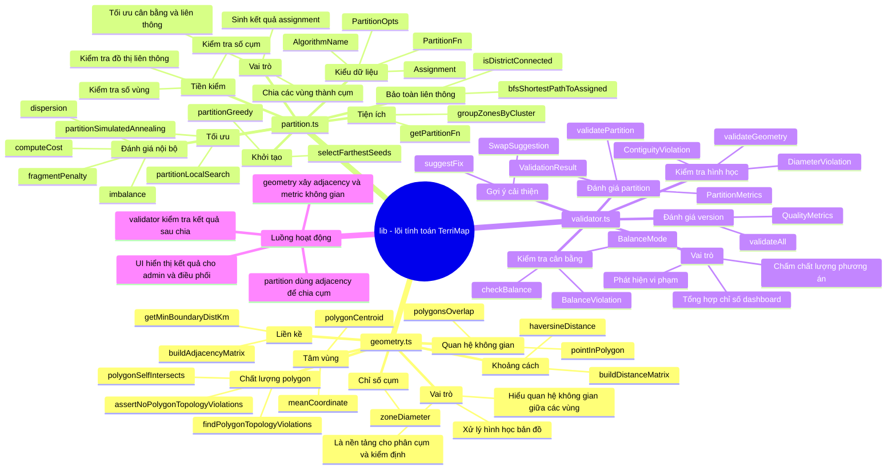
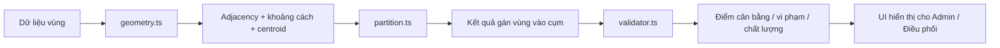

# Sơ đồ tư duy về chức năng của `lib`

Tài liệu này tóm tắt nhanh vai trò của từng phần trong thư mục `lib` để bạn:

- nhìn tổng thể thật nhanh;
- giải thích khi thuyết trình;
- nhớ được mối quan hệ giữa `geometry`, `partition`, `validator`.

---

## Sơ đồ tư duy tổng quan

---

## Cách đọc sơ đồ

## 1. `geometry.ts` - hiểu bản đồ

Bạn có thể nói ngắn gọn:

- file này giúp hệ thống “hiểu hình học” của dữ liệu;
- nó xử lý khoảng cách, centroid, tiếp giáp, chồng lấn, lỗi topo;
- đây là nền móng để phần phân chia chạy đúng.

### Tác dụng chính

- đo khoảng cách giữa các vùng;
- xác định vùng nào kề vùng nào;
- phát hiện polygon bị lỗi;
- tính độ rộng của một cụm.

## 2. `partition.ts` - chia cụm

Bạn có thể nói ngắn gọn:

- file này là nơi chạy thuật toán phân chia lãnh thổ;
- đầu vào là danh sách vùng + số cụm;
- đầu ra là mỗi vùng thuộc cụm nào.

### Tác dụng chính

- tạo lời giải ban đầu bằng `Greedy`;
- cải thiện bằng `Local Search`;
- tối ưu sâu hơn bằng `Simulated Annealing`;
- đảm bảo các cụm vẫn liền thông;
- tính `cost` để biết phương án nào tốt hơn.

## 3. `validator.ts` - chấm chất lượng

Bạn có thể nói ngắn gọn:

- file này không trực tiếp chia cụm;
- nó dùng để kiểm tra xem kết quả chia có tốt hay không.

### Tác dụng chính

- kiểm tra cân bằng giữa các cụm;
- kiểm tra cụm có bị đứt không;
- kiểm tra cụm có quá rộng không;
- tạo chỉ số tổng hợp để hiển thị trên dashboard.

---

## Sơ đồ luồng đơn giản

---

## Phiên bản cực ngắn để thuyết trình

Nếu bạn cần nói rất nhanh, có thể dùng đúng 3 ý này:

- `geometry.ts`: xử lý bản đồ và quan hệ không gian giữa các vùng.
- `partition.ts`: chạy thuật toán để chia vùng thành các cụm cân bằng, liên thông.
- `validator.ts`: kiểm tra và chấm chất lượng phương án sau khi phân chia.

---

## Gợi ý dùng khi bảo vệ

Khi chiếu sơ đồ này, bạn nên nói theo thứ tự:

1. `geometry` là lớp nền;
2. `partition` là lớp ra quyết định;
3. `validator` là lớp kiểm định;
4. giao diện chỉ là nơi hiển thị kết quả của ba lớp trên.

Như vậy người nghe sẽ thấy:

- dự án không chỉ có UI;
- phần lõi được tổ chức rõ ràng;
- thuật toán và kiểm định đã được tách trách nhiệm mạch lạc.
